# ChatBuddy - VS Code AI Assistant Extension

> 最后更新：2026-05-25

---

## 📑 快速导航

| 栏目 | 说明 |
|------|------|
| [项目愿景](#项目愿景) | 核心理念与特性 |
| [架构总览](#架构总览) | 分层设计与核心原则 |
| [模块结构](#模块结构图) | Mermaid 可视化结构图 |
| [模块索引](#模块索引) | 所有模块的快速索引 |
| [开发指南](#开发指南) | 环境要求、编码规范、提交规范 |
| [AI 指引](#ai-使用指引) | AI 辅助开发注意事项 |
| [目录结构](#项目目录结构) | 顶层目录布局总览 |
| [故障排查](#故障排查) | 常见问题与解决方案 |
| [相关文档](#相关文档) | 架构、存储、协议、贡献指南 |

---

## 项目愿景

ChatBuddy 是一个功能强大的 VS Code AI 助手扩展，致力于提供无缝的多助手 AI 对话体验。项目核心理念是**开放性与可扩展性**——通过统一的 OpenAI 兼容 API 客户端，支持任意 AI 提供商，并通过 MCP (Model Context Protocol) 集成外部工具与资源，将 AI 能力无缝融入开发工作流。

### 核心特性

- **多助手管理**：创建、组织、切换多个 AI 助手，每个助手独立配置系统提示词、模型和参数
- **助手模板**：保存助手配置为可复用模板，一键从模板创建新助手
- **多提供商兼容**：支持 OpenAI、Gemini、OpenRouter、Ollama 及任何 OpenAI 兼容的自定义端点
- **提供商故障转移**：配置备选模型引用链，主模型失败时自动切换到下一个
- **MCP 集成**：连接 MCP 服务器（stdio/SSE/HTTP），扩展 AI 的工具调用、资源读取和 Prompt 能力
- **MCP 服务器分组**：将 MCP 服务器组织为命名分组，启用/禁用级联管理
- **流式响应**：实时流式输出，支持中断生成
- **多模态聊天**：图片粘贴（支持多图）、数学公式渲染（KaTeX）、图表渲染（Mermaid）
- **文档解析**：PDF / DOCX / PPTX 文件自动提取文本内容
- **文件附件**：聊天中以可折叠卡片形式显示文件，不再混入代码块
- **OCR 降级**：非视觉模型收到图片时，自动通过 OCR 提取文字
- **图片外部存储**：图片 base64 数据保存到 `images/` 目录，减少状态内存占用
- **工具调用**：本地函数工具 + MCP 远程工具，危险操作需用户确认
- **模型能力推断**：自动检测模型类型（chat/image/video/audio/embedding/rerank）和能力（vision/reasoning/tools/webSearch）
- **双语 UI**：完整的中英文支持，运行时语言切换
- **数据备份与迁移**：导出/导入结构化 ZIP 备份，自动从旧版 SQLite 迁移

---

## 架构总览

ChatBuddy 采用**分层架构设计**，核心业务逻辑与 VS Code API 解耦，通过适配层（`src/extension/`）进行桥接。

### 核心设计原则

1. **单一状态源（Single Source of Truth）**：`ChatStateRepository` 管理所有运行时状态
2. **服务拆分**：Repository 内部按领域拆分为 `AssistantStateService`、`SessionStateService`、`StatePersistenceService`
3. **版本缓存**：状态读取带版本缓存，避免不必要的深拷贝
4. **分层解耦**：业务核心层不依赖 VS Code API，通过适配层桥接
5. **事件驱动**：通过 `refreshAll()` 和 `updateTreeMessage()` 统一触发视图刷新

---

## 模块结构图

```mermaid
graph TD
    Root["(根) ChatBuddy"] --> Extension["src/extension (扩展适配层)"]
    Root --> ChatBuddy["src/chatbuddy (业务核心层)"]

    Extension --> ExtMain["extension.ts (入口)"]
    Extension --> ExtCmds["commands/ (命令注册)"]
    Extension --> ExtPanel["panelControllers.ts (面板控制器)"]
    Extension --> ExtTree["treeViews.ts (树视图)"]

    ChatBuddy --> StateRepo["stateRepository (状态管理)"]
    ChatBuddy --> ChatCtrl["chatController (聊天控制器)"]
    ChatBuddy --> Provider["providerClient (提供商客户端)"]
    ChatBuddy --> McpRuntime["mcpRuntime (MCP 运行时)"]
    ChatBuddy --> Compass["compassStorage/ (存储层)"]
    ChatBuddy --> Webview["webview* (WebView 渲染)"]
    ChatBuddy --> Settings["settingsCenter* (设置中心)"]
    ChatBuddy --> I18n["i18n/ (国际化)"]
    ChatBuddy --> Utils["utils/ (工具函数)"]

    StateRepo --> AssistantSvc["AssistantStateService"]
    StateRepo --> SessionSvc["SessionStateService"]
    StateRepo --> PersistenceSvc["StatePersistenceService"]

    ChatCtrl --> GenSvc["ChatGenerationService"]
    ChatCtrl --> PanelMgr["ChatPanelManager"]
    ChatCtrl --> ToolOrch["ToolCallOrchestrator"]

    StateRepo --> ImportExportSvc["stateRepositoryImportExport"]

    Compass --> Paths["paths.ts"]
    Compass --> Io["io.ts"]
    Compass --> KvStore["kvStore.ts"]
    Compass --> SessionStore["sessionStore.ts"]
    Compass --> SettingsStore["settingsStore.ts"]

    Webview --> ChatHtml["webviewChatHtml.ts"]
    Webview --> ChatScript["webviewChatScript.ts"]
    Webview --> ChatEvents["webviewChatScriptEvents.ts"]
    Webview --> ChatMarkdown["webviewChatScriptMarkdown.ts"]
    Webview --> ChatUi["webviewChatScriptUi.ts"]

    Settings --> SettingsPanel["settingsCenterPanel.ts"]
    Settings --> SettingsJs["settingsCenterJs/"]
    Settings --> AssistantEditor["assistantEditorPanel.ts"]

    click Extension "./src/extension/CLAUDE.md" "查看扩展适配层文档"
    click ChatBuddy "./src/chatbuddy/CLAUDE.md" "查看业务核心层文档"
    click Compass "./src/chatbuddy/compassStorage/CLAUDE.md" "查看存储层文档"
    click Webview "./src/chatbuddy/CLAUDE.md" "查看 WebView 渲染文档"
    click Settings "./src/chatbuddy/CLAUDE.md" "查看设置中心文档"
```



---

## 模块索引

| 模块 | 路径 | 职责 | 文档 |
|------|------|------|------|
| **扩展适配层** | `src/extension/` | VS Code API 桥接、命令注册、视图管理 | [CLAUDE.md](src/extension/CLAUDE.md) |
| **状态管理** | `src/chatbuddy/stateRepository*.ts` | 单一状态源、助手/会话/持久化/导入导出 | [CLAUDE.md](src/chatbuddy/CLAUDE.md) |
| **聊天控制器** | `src/chatbuddy/chatController*.ts` | 消息路由、流式响应、工具调用编排 | [CLAUDE.md](src/chatbuddy/CLAUDE.md) |
| **提供商客户端** | `src/chatbuddy/providerClient*.ts` | OpenAI 兼容 API 调用、模型列表获取 | [CLAUDE.md](src/chatbuddy/CLAUDE.md) |
| **MCP 运行时** | `src/chatbuddy/mcpRuntime.ts` | MCP 服务器连接、工具/资源/Prompt 管理 | [CLAUDE.md](src/chatbuddy/CLAUDE.md) |
| **存储层** | `src/chatbuddy/compassStorage/` | Compass 结构化存储、迁移、I/O | [CLAUDE.md](src/chatbuddy/compassStorage/CLAUDE.md) |
| **聊天存储** | `src/chatbuddy/chatStorage.ts` | 聊天数据读写抽象 | [CLAUDE.md](src/chatbuddy/CLAUDE.md) |
| **本地备份** | `src/chatbuddy/localBackup.ts` | 本地 ZIP 备份导出 | [CLAUDE.md](src/chatbuddy/CLAUDE.md) |
| **视图管理** | `src/chatbuddy/*View.ts` | 助手/会话树视图数据提供 | [CLAUDE.md](src/chatbuddy/CLAUDE.md) |
| **WebView 渲染** | `src/chatbuddy/webview*.ts` | 聊天界面 HTML/CSS/JS 生成 | [CLAUDE.md](src/chatbuddy/CLAUDE.md) |
| **设置中心** | `src/chatbuddy/settingsCenter*.ts` | 设置面板、助手编辑器、模型配置 | [CLAUDE.md](src/chatbuddy/CLAUDE.md) |
| **国际化** | `src/chatbuddy/i18n/` | 中英文字符串、运行时语言切换 | [CLAUDE.md](src/chatbuddy/i18n/CLAUDE.md) |
| **工具函数** | `src/chatbuddy/utils/` | 通用工具函数（日志、重试、模板等） | [CLAUDE.md](src/chatbuddy/utils/CLAUDE.md) |

---

## 开发指南

环境要求：**Node.js >= 20.x**、**VS Code >= 1.85.0**、**TypeScript ^5.3.0**

关键依赖：`@modelcontextprotocol/client` ^2.0.0-alpha.2、`katex` ^0.16.45、`mermaid` ^11.14.0、`zod` ^4.3.6、`pdf-parse` ^2.4.5、`mammoth` ^1.12.0、`jszip` ^3.10.1、`@cfworker/json-schema` ^4.1.1

开发脚本：`npm run compile`（编译）、`npm run watch`（监听）、`npm run test`（测试）、`npm run test:coverage`（覆盖率）、`npm run lint`（检查）、`npm run package`（打包）

编码规范、提交规范（Conventional Commits，英文）、测试策略等详细内容见 [贡献指南](docs/CONTRIBUTING.md)。

---

## AI 使用指引

### 适合 AI 辅助的任务

1. **重构优化**: 模块拆分、性能优化、代码简化
2. **测试编写**: 单元测试、边界测试、集成测试
3. **文档更新**: API 文档、架构说明、使用指南
4. **Bug 修复**: 错误处理、边界条件、类型安全
5. **功能扩展**: 新增 Provider、新工具、新特性

### AI 协作注意事项

- **遵循架构**: 保持分层设计，避免循环依赖
- **类型安全**: 充分利用 TypeScript 类型系统
- **测试优先**: 修改代码前先编写或更新测试
- **中文优先**: 注释和文档使用中文，技术术语保留英文

### 关键约束

- **存储格式**: Compass 结构化存储（JSON/JSONL），不使用 SQLite
- **MCP 模块**: ESM-only，通过动态 `import()` 加载
- **WebView 安全**: 严格 CSP 策略，不使用 `eval` 或 `innerHTML`
- **状态同步**: 通过 `refreshAll()` 统一触发刷新，避免直接操作 TreeView

---

## 项目目录结构

```
ChatBuddy/
├── .claude/                    # AI 上下文文件
├── src/
│   ├── extension.ts            # 扩展入口
│   ├── extension/              # 扩展适配层（命令、面板、树视图）
│   ├── chatbuddy/              # 业务核心层（状态、聊天、提供商、MCP、存储、渲染、设置、i18n、工具）
│   └── test/                   # 测试文件
├── docs/                       # 架构文档
├── media/                      # 图标和资源
├── out/                        # 编译输出
├── package.json                # 扩展清单
└── tsconfig.json               # TypeScript 配置
```

---

## 故障排查

| 问题 | 原因 | 解决方案 |
|------|------|---------|
| MCP 服务器无法启动 | ESM-only 需动态 `import()`，或路径/权限错误 | 检查 `mcpRuntime.ts` 的 `import()` 语法和服务器路径 |
| TreeView 不刷新 | 直接操作 TreeView 而非通过统一刷新 | 使用 `refreshAll()` 触发刷新 |
| `Cannot find module 'vscode'` | `@types/vscode` 未安装或 tsconfig 配置问题 | `npm install`，确认 `module: "Node16"` |
| 测试 `MODULE_NOT_FOUND` | ESM 导入需要正确的模块解析 | 确认 `package.json` 有 `"type": "module"` |
| WebView CSS 未生效 | 样式字符串模板引号转义问题 | 检查模板字符串中的正则替换 |
| MCP 调用超时 | 服务器进程未启动或协议不匹配 | 检查超时配置和服务器路径，查看输出面板日志 |
| WebView HTML 生成异常 | 模板字符串转义/拼接问题 | 检查 `webviewChatHtml.ts` 中的字符串拼接 |
| 文件附件导致 API 400 | 文件内容 + 上下文超出 token 限制 | 减小「上下文数」设置（默认 16→4-8），注意多文件累积 |
| 生成中断显示 "This operation was aborted" | 超时竞态：`abort()` 先于 `setAbortReason` 执行 | 已修复（先设原因再 abort），超时仅在首次响应等待阶段生效 |
| 聊天面板重新打开后空白不渲染 | WebView 脚本重注入守卫在 `<script>` 顶层使用 `return` 静默终止了整个脚本 | 已修复（改用 `vscode.postMessage` 代替 `return`） |
| Mermaid 图表缺少箭头/图标 | `sanitizeSvg` 移除了所有 `<use>` 元素，包括有效的内部引用 | 已修复（仅移除外部 `href` 的 `<use>`） |
| 跨 IDE 同步后 API Key 丢失 | `reloadFromSharedStorage()` 中 `flush()` 覆盖了其他 IDE 写入的 keys；`persistSecrets()` 从内存而非磁盘读取 keys | 已修复（flush 前保存磁盘 keys 三向合并；`persistSecrets` 改用 `readProviderApiKeysFromDisk()`） |
| MCP 探测结果与服务器不匹配 | 探测结果按数组索引而非服务器 ID 过滤 | 已修复（按 `serverId` 匹配） |
| 结构化文件写入失败导致 API keys 丢失 | `settingsStore.persist()` 中结构化文件写入异常时 `return` 跳过了后续 API keys 写入 | 已修复（移除提前返回，API keys 写入独立 try-catch） |
| 设置变更后 `getState()` 返回旧数据 | `updateSettings()` 修改 state 后未调用 `bump()` 失效缓存 | 已修复（state 修改后立即 `bump()`） |
| MCP server 删除后被竞态重建 | `deleteMcpServer` 处理后过期 `saveMcpServers` 消息重新引入已删除 server | 已修复（`recentlyDeletedMcpServerIds` 竞态保护 + save 过滤） |
| `persist()` 静默吞掉后续更新 | `persistScheduled` 布尔去重导致并发状态变更被丢弃 | 已修复（`persistDirty` 标志 + 自动重触发） |
| 高频跨 IDE 写入时磁盘数据丢失 | `mergeWithDisk()` 重试耗尽返回纯内存状态，丢弃其他 IDE 数据 | 已修复（返回最后一次合并结果） |
| 已删除 provider 的 API key 从磁盘复活 | `persistSecrets()` 合并磁盘 keys 时未排除本会话已删除的 provider | 已修复（合并时过滤 `deletedProviderIds`） |
| `readProviderApiKeysFromDisk` 性能差 | 每次调用加载全部 10 个结构化文件 | 已修复（仅读 `providers.api-keys.json` 单文件） |
| `applyProviderApiKeysToSettings` 不必要的对象创建 | 每次调用都重建所有 provider 对象，即使 keys 未变 | 已修复（短路检测，未变时返回原对象） |

---

## 相关文档

- [架构详细文档](./docs/ARCHITECTURE.md) — 模块分层、数据流、依赖关系
- [存储格式文档](./docs/STORAGE.md) — Compass 存储结构与迁移机制
- [WebView 通信协议](./docs/WEBVIEW_PROTOCOL.md) — Extension Host ↔ WebView 消息格式
- [贡献指南](./docs/CONTRIBUTING.md) — 开发环境搭建、编码规范、提交规范、测试
- [更新日志](./CHANGELOG.md) — 版本历史与变更记录
